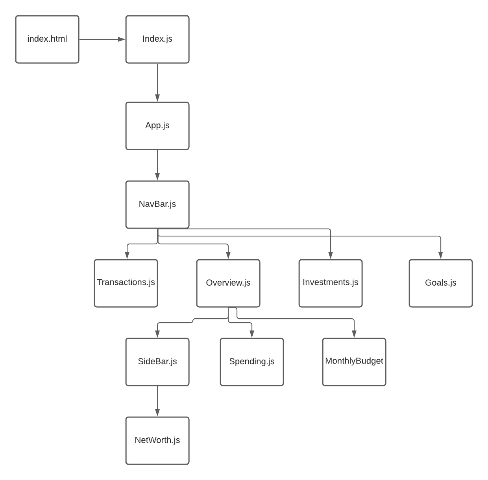
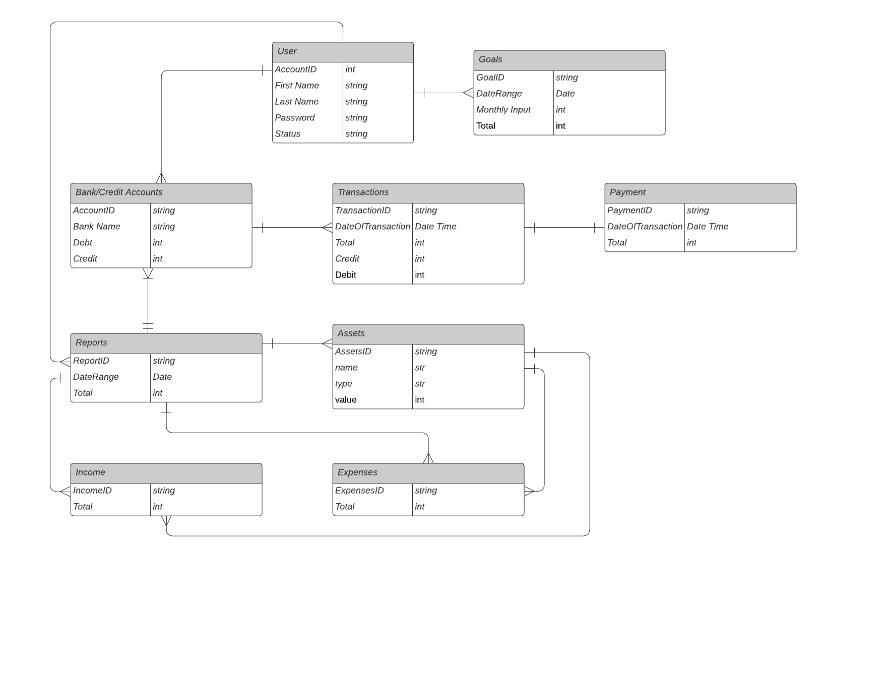

# FIRE
## Date: August 29, 2021
### Made by: Wei Jun Xia

[Live Demo](https://shrouded-basin-08350.herokuapp.com/) | [Trello](https://trello.com/invite/b/WoAfMwPo/71536ca21cb742eadf450bc81c54582e/peronal-finanace-mern) | [Connect on LinkedIn](https://www.linkedin.com/in/w3i/)

## 📝 About
FIRE (Financially Independent, Retire Early) is a personal finance app aimed to help users track their finances and retire early. FIRE is built with the MERN stack, using React as our front-end, Node.js and Express as our back-end, and MongoDB as our database. 

  <h3>Tech Stack</h3>
  

## 📊 Component Hierarchy Diagram

## 📊 Entity Relationship Diagram

## 🛠 App Functionality
Users will be able to track all of their expenses, income, and investments through the Plaid API as well as be provided visualization tools and goal setting tools to help them plan for their future. 

